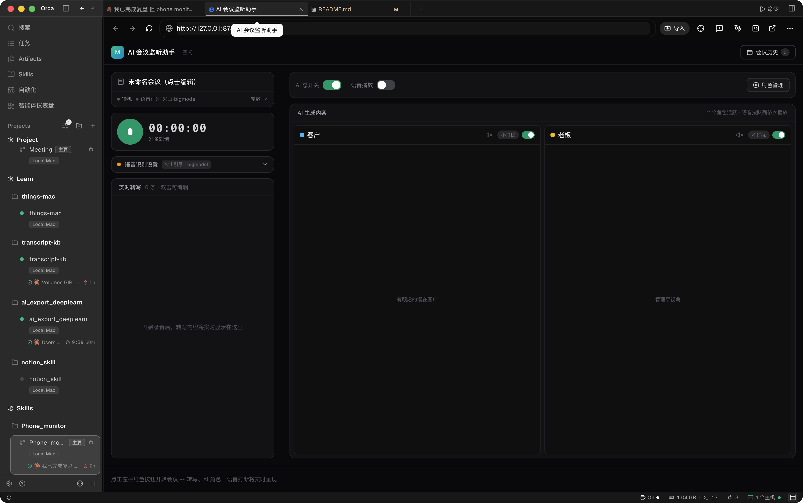
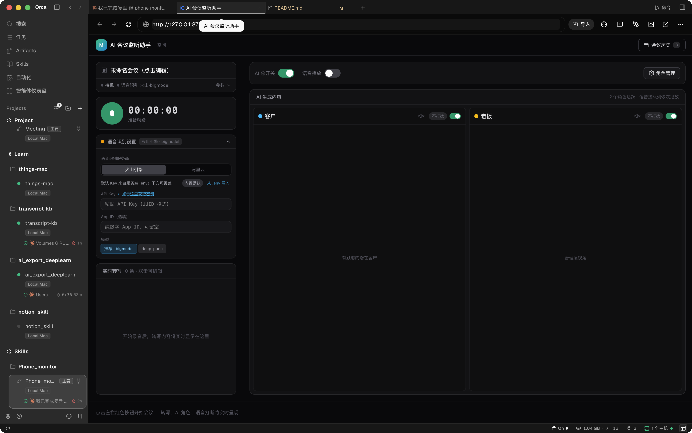
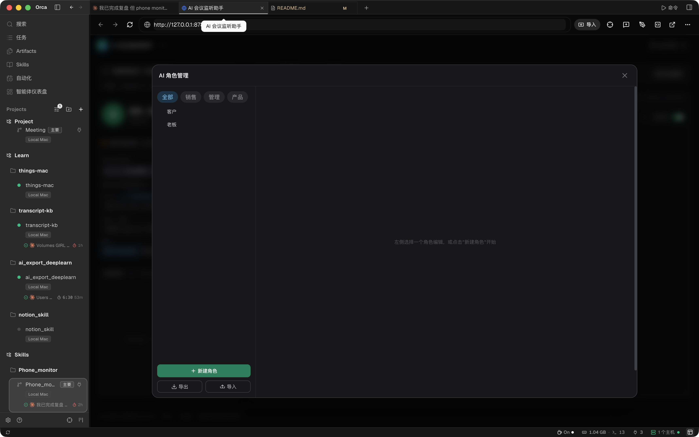

<div align="center">

# 🎭 AI Meeting Roles — 多角色会议模拟器

**你说话，AI 们在听、在思考、在表达——甚至会像真人一样打断你**

[ macOS ] [ Vue 3 + TypeScript ] [ FastAPI ] [ Claude Code CLI ] [ CosyVoice TTS ] [ 豆包 ASR ]

</div>

---

## 这是什么？

一场**没有真人参加的多人会议**。

你对着麦克风正常表达，AI 扮演的「客户」「老板」等角色在另一侧：

- 🦻 **实时听**你说的每一个字（流式语音识别）
- 🧠 **独立思考**——每个角色都是一份独立的人格设定 + 提示词，站在自己的立场上评估你的表达
- 🗣 **用语音回应**——不是冷冰冰的文字，而是有音色、有语速、有情绪的开口说话
- ✋ **像真人一样打断你**——当你说了价格却没讲价值、明显在背话术、偏离主题时，角色会直接插话
- 👂 **听多说少**——不是每 10 秒机械发言一句。没有值得回应的内容时，他会安静地「再听听」；他的内心独白你能看见，但不会说出口

## 为什么做这个？

> 每个人都站在自己的立场表达。老板不在、客户不在、那个关键的人不在时，
> 你永远猜不到他此刻会怎么看你正在说的这件事。
>
> AI 或许不能完全复制一个人，但它**至少能在一定程度上模拟他的立场、风格和思维**——
> 足以激发你对这件事的重新认知和重新思考。

**使用场景**

| 场景 | 你能得到的 |
|---|---|
| 🧥 销售演练 | 模拟「难缠客户」当场插话质疑，检验你的应变 |
| 🧭 汇报彩排 | 模拟「犀利老板」复盘式提问，提前暴露漏洞 |
| 💭 立场预演 | 想知道"他会怎么看这件事"？让角色替他站在他的立场说一遍 |
| 🗣 表达训练 | 在真人面前丢脸之前，先在 AI 面前丢够 |

## 核心特性

### 真人感打断（不是弹窗，是"抢话"）
- 每个角色有独立的「可打断 / 不打扰」开关，放在该角色的栏目标题上
- 触发打断时：角色立即开口，其他 AI 闭嘴聆听，打断说完再继续——**模拟真人会议的插话语境**
- 打断内容约束在 40 字内、口语化，绝无大段 AI 味文字
- 语音全局队列：一次只有一个人在"说话"，新语音排队等待，打断插队首——**绝不叠音**

### 三类表达（AI 不是话痨）
| 类型 | 表现 |
|---|---|
| 💭 内心独白 | 观点区可见（灰色卡片），不出声——他心里在评估你 |
| 👂 再听听 | 本轮不开口，安静听你说 |
| 🗣 回复 / 打断 | 真正开口说话（语音 + 高亮卡片），打断带红色提示条 |

### 多角色架构
- 每个角色 = 独立的 Claude Code CLI 会话 + 独立人格提示词（`roles/<角色>/CLAUDE.md`）
- 内置角色市场（销售/管理/产品多个行业预设），支持自定义角色、提示词、音色、优先级
- 角色之间信息互通：每个角色的会话里都能看到其他角色说了什么

### 会议记录
- 自动生成会议标题与摘要
- 一键导出：纯用户转写 / 用户+AI 综合版（按时间轴合并，标注「观点/回复/插话」）
- 本地历史列表，可随时回看、回放录音

### 开源安全设计 🔐
- 所有密钥只存于本地 `.env`（已被 `.gitignore` 排除，**永不进仓库**）
- `.env.example` 提供完整打码示例（标注厂商 / 模型 / 型号 / 获取入口）
- TTS 密钥由后端持有，**不下发前端**；ASR 配置经本机接口导入
- 设置页「从 .env 导入」：改完配置文件一键生效，无需在界面上逐项填写

## 界面预览

| 主界面（双角色观点流） | 语音识别设置 | 角色管理 |
|:---:|:---:|:---:|
|  |  |  |

## 快速开始（macOS）

> 当前仅支持 **macOS**（角色大脑依赖 Claude Code CLI）

### 1. 环境要求

- Python 3.10+，Node.js 18+
- [Claude Code CLI](https://claude.com/product/claude-code)（已登录）
- 两个云服务的账号（见下表）

| 能力 | 厂商 / 模型 | 获取入口 |
|---|---|---|
| 语音识别（听你说话） | 火山引擎 · 豆包流式 ASR 2.0（bigmodel） | [控制台](https://console.volcengine.com/audio/overview/) |
| 语音合成（AI 说话） | 阿里云百炼 · CosyVoice v3.5-plus | [控制台](https://bailian.console.aliyun.com/) |

### 2. 配置密钥

```bash
cp .env.example .env
# 编辑 .env，把星号占位替换成你自己的真实密钥（文件内有逐项说明）
```

### 3. 启动

```bash
# 前端构建
cd web && npm install && npm run build && cd ..

# 启动网关（含角色编排、TTS、ASR 中转）
python3 server/gateway/main.py
```

浏览器打开 **http://127.0.0.1:8787**

### 4. 首次使用

1. 左侧展开「语音识别」设置 → 点 **「从 .env 导入」**（自动填入豆包 ASR 配置）
2. 想让角色开口说话：打开「语音播放」总开关 + 各角色的 🔊 喇叭
3. 想体验打断：把某角色的「不打扰」切成「可打断」
4. 点 ▶ 开始说话

## 项目结构

```
Meeting/
├── server/gateway/        # FastAPI 网关：角色编排 / TTS / ASR 中转 / 会议归档
│   ├── main.py            # 主服务（端口 8787，仅本机）
│   └── agents.py          # Claude CLI 角色代理运行时（隔离 CLAUDE_CONFIG_DIR）
├── web/                   # Vue 3 + TS 前端
│   └── src/
│       ├── components/    # 录音面板 / 角色观点流 / 角色管理 / 打断提示条
│       ├── services/      # TTS 播放队列 / 豆包 ASR 客户端 / 历史存储
│       └── stores/        # 会议状态机（Pinia）
├── roles/                 # 角色人格（每个角色一份 CLAUDE.md 提示词）
│   ├── customer/          # 内置：客户
│   └── boss/              # 内置：老板
├── docs/                  # 截图与文档
├── .env.example           # 配置模板（打码示例，随仓库分发）
└── .env                   # 你的真实密钥（gitignore 排除，不会上传）
```

## 常见问题

**Q：我的 API Key 会被上传吗？**
不会。`.env` 在 `.gitignore` 中被排除，且 TTS 密钥只存在后端内存，前端拿不到。仓库里只有打码的 `.env.example`。

**Q：会议录音会上传吗？**
不会。录音、转写、会议记录全部保存在你本机 `Record/` 目录（同样被 gitignore 排除）。

**Q：两个 AI 会同时说话吗？**
不会。全局语音队列保证同一时间只有一条语音在播，打断语音插队首，其余排队。

## License

MIT

---

<div align="center">

**如果这个项目对你有帮助，欢迎 Star ⭐ / 收藏 —— 这是对独立开发最大的鼓励**

</div>
